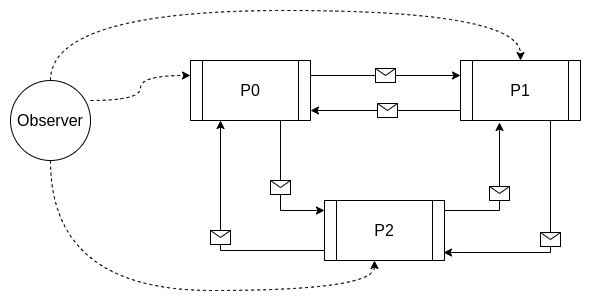
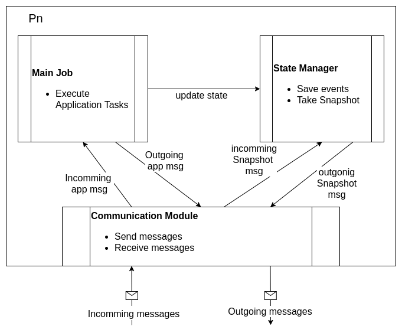
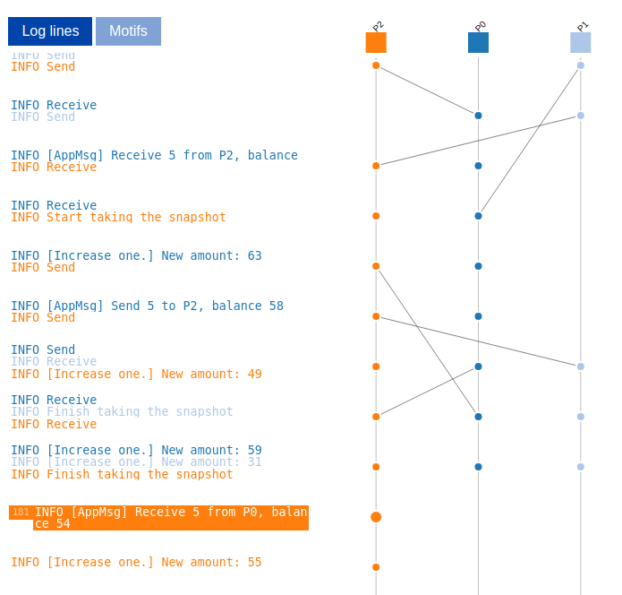

# Chandy Lampor Algorithm

This project is an implementation example of the Chandy-Lamport algorithm for obtaining snapshots of the global state of a distributed system. It uses the vector clock logging library [Govector](https://github.com/DistributedClocks/GoVector) to log events and messages. It is possible to use the generated logs to draw the behavior of the network in the [ShiViz](https://bestchai.bitbucket.io/shiviz/) tool.

## Usage

If you want to use this project, remember to install the required libraries using `go mod tidy` and change the local references in the helpers and test files.

## System design

The network is composed of several independent processes, which communicate through messages while performing their tasks. All of them are able to take a Snapshot of their status at any time, without interrupting the main workflow. The snapshot process can be triggered by any of the processes, or by an external observer.

Starting from this general idea of the distributed system, the internal modules of each process are defined.

Once the logs are generated, it is possible to draw trace the messages along with the internal events of the processes. Remember to join all the processes logs and add the regular expression required by Shiviz.

If you need more information related to this project, don't hesitate to contact me.
